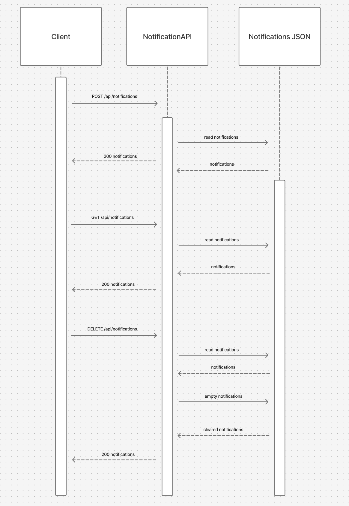

# CS361_Notifications
A lightweight REST API microservice for managing notifications. Supports adding, retrieving, and clearing notifications.

## Base URL
http://localhost:3002

## Endpoints
POST http://localhost:3002/api/notifications — add a notification
GET http://localhost:3002/api/notifications — get all notifications
DELETE http://localhost:3002/api/notifications — clear all notifications

### Add a notification
POST /api/notifications
Body: { "message": "your message", "type": "success | error | warning | info" }

### Get all notifications
GET /api/notifications

### Clear all notifications
DELETE /api/notifications

## UML Sequence Diagram 

## Notification Types
| Type | When to use |
|------|-------------|
| success | Action completed successfully |
| error | Something went wrong |
| warning | User should be aware of something |
| info | General information |
